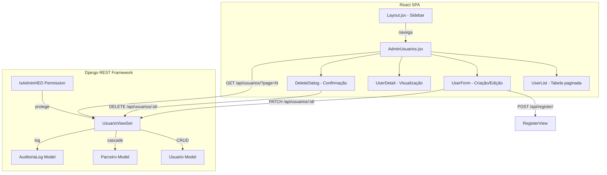
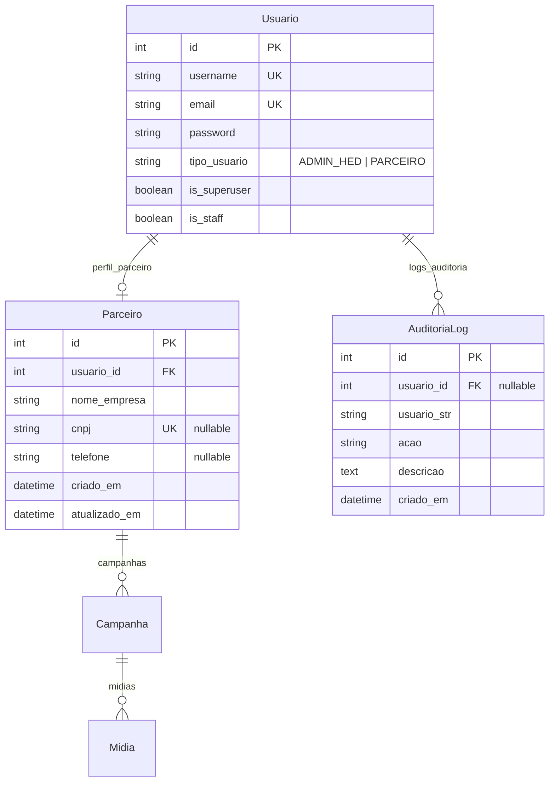

# Design Document: Admin User Management

## Overview

Esta funcionalidade expande a página existente "Novo Usuário" em uma seção completa de gerenciamento CRUD de usuários parceiros no painel administrativo do HED AD. A implementação envolve:

- **Backend**: Estender o `UsuarioViewSet` existente com permissões restritas a ADMIN_HED, adicionar endpoints de edição/exclusão com validação, e registrar ações no `AuditoriaLog`.
- **Frontend**: Substituir a página `AdminNovoUsuario.jsx` por uma nova página `AdminUsuarios.jsx` com três modos (lista, criação, edição/detalhes), reutilizando os utilitários de formatação (CNPJ, telefone) e validação já existentes.
- **Navegação**: Renomear o item do sidebar de "Novo Usuário" para "Usuários" com ícone `PeopleIcon`, apontando para `/admin/usuarios`.

A abordagem mantém a arquitetura existente (DRF ViewSets + React SPA com Axios) sem introduzir novas dependências.

## Architecture



### Decisões Arquiteturais

1. **Reutilizar `RegisterView` para criação**: O endpoint `/api/register/` já implementa toda a lógica de criação de usuário + parceiro + envio de email. A página de criação continuará usando este endpoint, evitando duplicação.

2. **Estender `UsuarioViewSet` para edição/exclusão**: Adicionar actions `update` e `destroy` com permissão `IsAdminHED`, incluindo lógica de atualização do `Parceiro` associado.

3. **Página única com estados internos**: Em vez de múltiplas rotas (`/admin/usuarios`, `/admin/usuarios/novo`, `/admin/usuarios/:id`), usar uma única página com estado interno (`mode: 'list' | 'create' | 'edit' | 'detail'`). Isso simplifica a navegação e mantém o padrão existente do projeto (páginas monolíticas).

4. **Paginação server-side**: Usar `PageNumberPagination` do DRF com `page_size=10` para a listagem, retornando `count`, `next`, `previous` e `results`.

5. **Novas ações de auditoria**: Adicionar `EDICAO_USUARIO` e `EXCLUSAO_USUARIO` ao `ACAO_CHOICES` do `AuditoriaLog`.

## Components and Interfaces

### Backend Components

#### 1. Permission Class: `IsAdminHED`

```python
# signage/permissions.py
class IsAdminHED(permissions.BasePermission):
    """Permite acesso apenas a usuários ADMIN_HED."""
    def has_permission(self, request, view):
        user = request.user
        return (
            user and user.is_authenticated and
            (user.is_superuser or getattr(user, 'tipo_usuario', None) == 'ADMIN_HED')
        )
```

#### 2. Serializer: `UsuarioDetailSerializer`

```python
# signage/serializers.py
class UsuarioDetailSerializer(serializers.ModelSerializer):
    nome_empresa = serializers.CharField(source='perfil_parceiro.nome_empresa', read_only=True)
    cnpj = serializers.CharField(source='perfil_parceiro.cnpj', read_only=True)
    telefone = serializers.CharField(source='perfil_parceiro.telefone', read_only=True)
    criado_em = serializers.DateTimeField(source='perfil_parceiro.criado_em', read_only=True)
    total_campanhas = serializers.SerializerMethodField()

    class Meta:
        model = Usuario
        fields = ['id', 'username', 'email', 'tipo_usuario', 'nome_empresa', 'cnpj', 'telefone', 'criado_em', 'total_campanhas']

    def get_total_campanhas(self, obj):
        if hasattr(obj, 'perfil_parceiro'):
            return obj.perfil_parceiro.campanhas.count()
        return 0
```

#### 3. Serializer: `UsuarioUpdateSerializer`

```python
class UsuarioUpdateSerializer(serializers.Serializer):
    email = serializers.EmailField(required=True)
    password = serializers.CharField(required=False, allow_blank=True)
    nome_empresa = serializers.CharField(required=True, min_length=3, max_length=150)
    cnpj = serializers.CharField(required=False, allow_blank=True)
    telefone = serializers.CharField(required=False, allow_blank=True)
```

#### 4. ViewSet: `UsuarioViewSet` (atualizado)

Ações:
- `list` — Retorna usuários PARCEIRO paginados (10/página), ordenados por `perfil_parceiro__criado_em` DESC
- `retrieve` — Retorna detalhes completos de um usuário com dados do parceiro
- `partial_update` — Atualiza email, senha (opcional), nome_empresa, cnpj, telefone
- `destroy` — Exclui usuário + parceiro + campanhas em cascata

#### 5. Pagination: `UsuarioPagination`

```python
from rest_framework.pagination import PageNumberPagination

class UsuarioPagination(PageNumberPagination):
    page_size = 10
    page_size_query_param = 'page_size'
    max_page_size = 50
```

### Frontend Components

#### 1. `AdminUsuarios.jsx` (Página Principal)

Estado interno controla o modo de exibição:
- `mode: 'list'` — Exibe tabela paginada
- `mode: 'create'` — Exibe formulário de criação (reutiliza lógica do AdminNovoUsuario)
- `mode: 'detail'` — Exibe detalhes do usuário selecionado
- `mode: 'edit'` — Exibe formulário de edição preenchido

Props/State:
```javascript
const [mode, setMode] = useState('list');
const [usuarios, setUsuarios] = useState([]);
const [selectedUser, setSelectedUser] = useState(null);
const [page, setPage] = useState(1);
const [totalCount, setTotalCount] = useState(0);
const [loading, setLoading] = useState(false);
const [error, setError] = useState('');
```

#### 2. Componente `UserList`

- Tabela MUI (`Table`) com colunas: username, email, nome_empresa, cnpj, criado_em
- Paginação via `TablePagination` (10 por página)
- Botão "Novo Usuário" no topo
- Clique na linha abre detalhes

#### 3. Componente `UserForm`

- Reutiliza validações e formatações do `AdminNovoUsuario.jsx` existente
- Modo criação: todos os campos editáveis, usa `POST /api/register/`
- Modo edição: username readonly, senha opcional, usa `PATCH /api/usuarios/:id/`
- Botão "Voltar" retorna à lista

#### 4. Componente `DeleteDialog`

- Dialog MUI com nome do usuário e contagem de campanhas
- Botões "Cancelar" e "Excluir"
- Desabilitado se o usuário alvo é o admin logado

### API Endpoints

| Método | Endpoint | Descrição | Permissão |
|--------|----------|-----------|-----------|
| GET | `/api/usuarios/?page=N` | Lista usuários PARCEIRO paginados | IsAdminHED |
| GET | `/api/usuarios/:id/` | Detalhes de um usuário | IsAdminHED |
| PATCH | `/api/usuarios/:id/` | Atualiza dados do usuário | IsAdminHED |
| DELETE | `/api/usuarios/:id/` | Exclui usuário e dados associados | IsAdminHED |
| POST | `/api/register/` | Cria novo usuário (existente) | IsAdminHED* |

*O `RegisterView` já existe e será mantido. A permissão atual é `AllowAny` com rate limiting; será alterada para exigir autenticação ADMIN_HED.

## Data Models

### Modelos Existentes (sem alteração estrutural)



### Alterações no Modelo `AuditoriaLog`

Adicionar novas opções ao `ACAO_CHOICES`:

```python
ACAO_CHOICES = (
    # ... existentes ...
    ('EDICAO_USUARIO', 'Edição de Usuário'),
    ('EXCLUSAO_USUARIO', 'Exclusão de Usuário'),
)
```

### Fluxo de Dados

1. **Listagem**: `GET /api/usuarios/?page=1` → ViewSet filtra `tipo_usuario='PARCEIRO'`, aplica paginação, serializa com `UsuarioDetailSerializer`
2. **Criação**: `POST /api/register/` → RegisterView cria Usuario + Parceiro + envia email (background thread)
3. **Edição**: `PATCH /api/usuarios/:id/` → ViewSet valida, atualiza Usuario.email + Usuario.password (se fornecida) + Parceiro.nome_empresa/cnpj/telefone, registra auditoria
4. **Exclusão**: `DELETE /api/usuarios/:id/` → ViewSet verifica que não é auto-exclusão, deleta Usuario (cascade remove Parceiro → Campanhas → Mídias), registra auditoria

## Correctness Properties

*A property is a characteristic or behavior that should hold true across all valid executions of a system — essentially, a formal statement about what the system should do. Properties serve as the bridge between human-readable specifications and machine-verifiable correctness guarantees.*

### Property 1: List endpoint returns only PARCEIRO users, paginated and ordered

*For any* set of users in the database (with mixed `tipo_usuario` values), calling `GET /api/usuarios/?page=N` as ADMIN_HED SHALL return only users with `tipo_usuario='PARCEIRO'`, with at most 10 results per page, ordered by `criado_em` descending (most recent first).

**Validates: Requirements 2.1, 2.3**

### Property 2: Serialization includes all required fields

*For any* Usuario with an associated Parceiro profile, the detail response from `GET /api/usuarios/:id/` SHALL include all of: `username`, `email`, `tipo_usuario`, `nome_empresa`, `cnpj`, `telefone`, `criado_em`, and `total_campanhas`.

**Validates: Requirements 2.2, 4.2**

### Property 3: Input validation correctly classifies valid and invalid inputs

*For any* string input, the validation functions SHALL accept the input if and only if it satisfies all applicable rules: username accepted iff it matches `^[a-z0-9.,]{3,}$`; email accepted iff it contains a valid email format; CNPJ accepted iff it has exactly 14 numeric digits (when non-empty); telefone accepted iff it has 10 or 11 numeric digits (when non-empty); password accepted iff it has ≥6 chars AND contains at least one uppercase, one lowercase, one digit, and one special character.

**Validates: Requirements 3.3, 3.4, 3.5**

### Property 4: Creation produces both Usuario and Parceiro with correct data

*For any* valid registration payload (valid username, email, password, nome_empresa, and optional cnpj/telefone), submitting to the register endpoint SHALL create a Usuario with `tipo_usuario='PARCEIRO'` and an associated Parceiro record containing the provided `nome_empresa`, `cnpj`, and `telefone`.

**Validates: Requirements 3.7**

### Property 5: Uniqueness constraints reject duplicate values

*For any* existing user in the database, attempting to create or update another user with the same `username`, `email`, or `cnpj` SHALL return a field-specific error indicating the value is already in use, without modifying any data.

**Validates: Requirements 3.9, 5.6, 5.7**

### Property 6: Update persists changes and handles optional password

*For any* valid update payload sent via `PATCH /api/usuarios/:id/`, the system SHALL persist the new `email`, `nome_empresa`, `cnpj`, and `telefone` values. If a valid `password` is provided, the user's password SHALL be updated; if `password` is empty or absent, the existing password SHALL remain unchanged.

**Validates: Requirements 5.4, 5.8**

### Property 7: Cascade deletion removes all associated data

*For any* Usuario with an associated Parceiro, Campanhas, and Mídias, deleting the Usuario via `DELETE /api/usuarios/:id/` SHALL remove the Usuario, the Parceiro, all associated Campanhas, and all associated Mídias from the database.

**Validates: Requirements 6.2**

### Property 8: Permission enforcement by role

*For any* API request to the user management endpoints: if the requester is unauthenticated, the response SHALL be HTTP 401; if the requester is authenticated with `tipo_usuario='PARCEIRO'`, the response SHALL be HTTP 403 without revealing user data; only requests authenticated with `tipo_usuario='ADMIN_HED'` SHALL be permitted to execute the operation.

**Validates: Requirements 7.1, 7.2, 7.3, 8.5**

### Property 9: Audit logging invariant

*For any* successful create, edit, or delete operation on a user, the system SHALL create an `AuditoriaLog` entry containing: a reference to the admin who performed the action (`usuario`), the admin's username as text (`usuario_str`), the correct action type (`REGISTRO_PARCEIRO` for create, `EDICAO_USUARIO` for edit, `EXCLUSAO_USUARIO` for delete), a description mentioning the target user's username, and an auto-generated `criado_em` timestamp.

**Validates: Requirements 7.5, 8.1, 8.2, 8.3, 8.4**

## Error Handling

### Backend Error Handling

| Cenário | Status HTTP | Resposta |
|---------|-------------|----------|
| Validação de campo falha | 400 | `{"field_errors": {"campo": "mensagem"}}` |
| Usuário/email/CNPJ duplicado | 400 | `{"field_errors": {"campo": "já está em uso"}}` |
| Usuário não encontrado | 404 | `{"error": "Usuário não encontrado."}` |
| Sem autenticação | 401 | `{"detail": "Authentication credentials were not provided."}` |
| Sem permissão (PARCEIRO) | 403 | `{"detail": "Você não tem permissão para realizar esta ação."}` |
| Auto-exclusão tentada | 400 | `{"error": "Não é possível excluir sua própria conta."}` |
| Erro interno | 500 | `{"error": "Erro interno do servidor."}` |

### Frontend Error Handling

1. **Erros de campo** (`field_errors`): Exibidos inline no campo correspondente via `helperText` do MUI TextField.
2. **Erros gerais**: Exibidos em `Alert` MUI acima do formulário.
3. **Erros de rede**: Detectados via `!error.response` no Axios, exibem mensagem genérica de falha de conexão.
4. **Timeout**: Axios timeout de 10s; se excedido, exibe mensagem de timeout.
5. **Notificações de sucesso/erro**: Via `Snackbar` MUI com `autoHideDuration` de 5000ms.

### Estratégia de Retry

- Nenhum retry automático para operações de escrita (POST, PATCH, DELETE) — evita duplicação.
- Para listagem (GET), o usuário pode clicar "Tentar novamente" manualmente.

## Testing Strategy

### Unit Tests (Backend - pytest + Django TestCase)

- Testar `IsAdminHED` permission com diferentes roles
- Testar `UsuarioDetailSerializer` com dados completos e parciais
- Testar `UsuarioUpdateSerializer` validação de campos
- Testar cascade deletion (Usuario → Parceiro → Campanhas → Mídias)
- Testar que auto-exclusão é bloqueada
- Testar criação de `AuditoriaLog` com campos corretos

### Unit Tests (Frontend - Vitest + React Testing Library)

- Testar funções de validação (username, email, CNPJ, telefone, senha)
- Testar formatação de CNPJ e telefone
- Testar renderização de estados (loading, error, empty)
- Testar navegação entre modos (list → create → list, list → detail → edit → list)

### Property-Based Tests (Backend - Hypothesis)

A biblioteca **Hypothesis** será utilizada para testes de propriedade no backend Python.

Configuração:
- Mínimo 100 iterações por propriedade
- Cada teste referencia a propriedade do design document

Propriedades a implementar:
- **Property 1**: Gerar conjuntos aleatórios de usuários com tipos mistos, verificar filtragem e ordenação
- **Property 3**: Gerar strings aleatórias, verificar que validação aceita/rejeita corretamente
- **Property 4**: Gerar payloads válidos aleatórios, verificar criação de Usuario + Parceiro
- **Property 5**: Gerar pares de usuários, verificar rejeição de duplicatas
- **Property 6**: Gerar payloads de update aleatórios, verificar persistência
- **Property 7**: Gerar usuários com dados associados, verificar cascade
- **Property 8**: Gerar requisições com diferentes roles, verificar respostas HTTP
- **Property 9**: Executar operações CRUD, verificar entradas de auditoria

Tag format: `Feature: admin-user-management, Property {N}: {title}`

### Integration Tests

- Fluxo completo: criar → listar → editar → excluir
- Verificar que email é enviado em background (mock do EmailService)
- Verificar paginação com >10 usuários
- Verificar redirect de `/admin/novo-usuario` para `/admin/usuarios`

