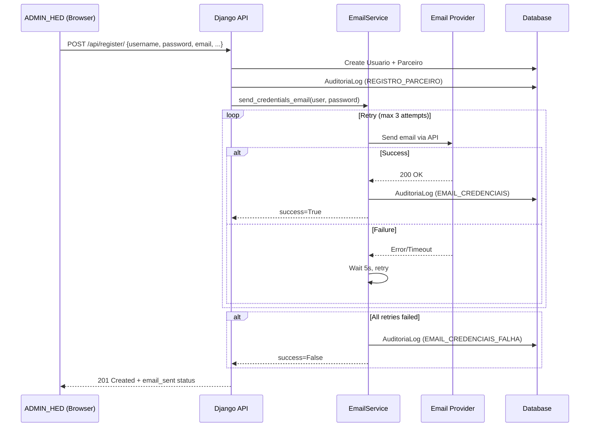
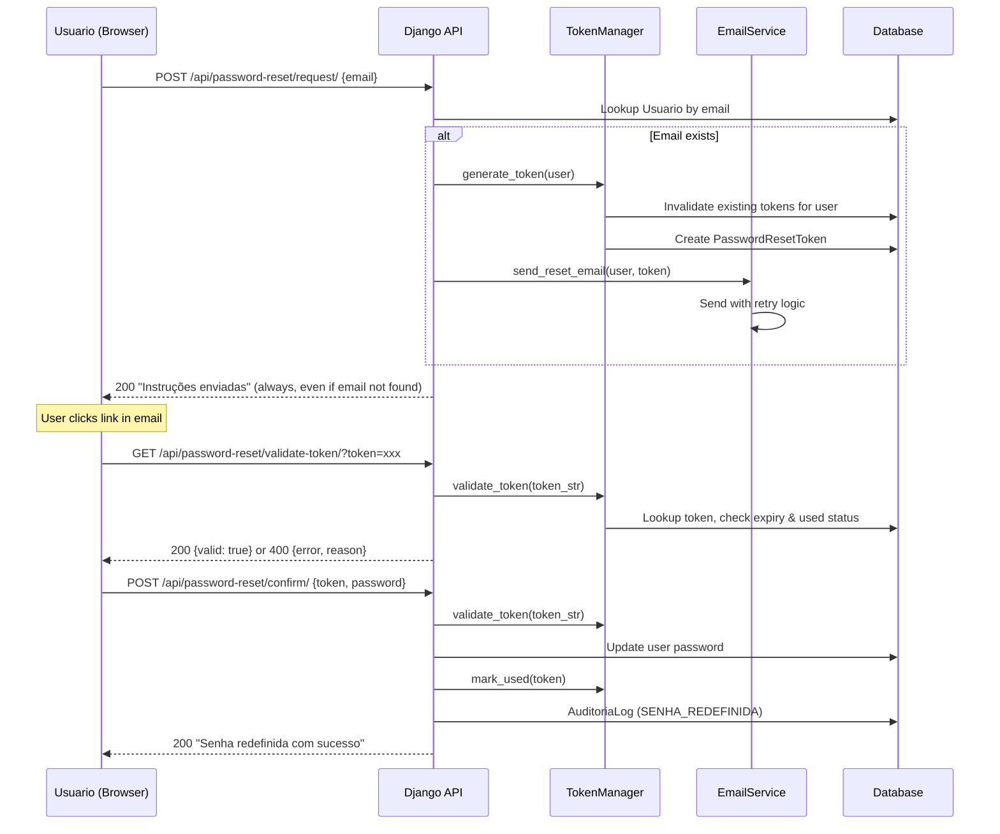

# Design Document: Email Credentials & Password Reset

## Overview

This design covers the implementation of transactional email capabilities, random password generation, and a complete "forgot password" flow for the HED AD digital signage platform. The feature spans both the Django backend (email service, token management, API endpoints) and the React frontend (UI components, new pages).

### Key Design Decisions

1. **Email Provider Abstraction**: An adapter pattern isolates the email sending logic from the provider SDK, allowing swaps between Resend, SendGrid, or Brevo without touching business logic.
2. **Token Strategy**: Password reset tokens use Django's built-in `PasswordResetTokenGenerator` combined with a custom `PasswordResetToken` model for single-use enforcement and explicit expiration tracking.
3. **Password Generation**: A pure utility function in the backend generates cryptographically random passwords using Python's `secrets` module — no external dependency needed.
4. **Rate Limiting**: Custom DRF throttle classes implement per-email and per-IP sliding window limits for the password reset endpoint.
5. **Retry Logic**: Email sending uses a synchronous retry loop (max 3 attempts, 5s delay) within the request lifecycle. A background task queue (Celery) is not introduced to keep deployment simple.

## Architecture

### High-Level Component Diagram

```mermaid
graph TB
    subgraph Frontend [React SPA]
        Login[Login.jsx]
        ForgotPw[EsqueciSenha.jsx]
        ResetPw[RedefinirSenha.jsx]
        AdminForm[AdminNovoUsuario.jsx]
    end

    subgraph Backend [Django API]
        RegisterView[RegisterView]
        ResetRequestView[PasswordResetRequestView]
        ResetConfirmView[PasswordResetConfirmView]
        ValidateTokenView[ValidateResetTokenView]
        EmailService[EmailService]
        PasswordGenerator[PasswordGenerator]
        TokenManager[TokenManager]
    end

    subgraph External [External Services]
        EmailProvider[Email Provider API<br/>Resend / SendGrid / Brevo]
    end

    AdminForm -->|POST /api/register/| RegisterView
    RegisterView -->|send credentials| EmailService
    Login -->|navigate| ForgotPw
    ForgotPw -->|POST /api/password-reset/request/| ResetRequestView
    ResetRequestView -->|send reset email| EmailService
    ForgotPw -->|success| ForgotPw
    ResetPw -->|POST /api/password-reset/confirm/| ResetConfirmView
    ResetPw -->|GET /api/password-reset/validate-token/| ValidateTokenView
    EmailService -->|HTTP API call| EmailProvider
    AdminForm -->|generate password (client-side)| PasswordGenerator
```

### Sequence Diagram — Credentials Email on Account Creation



### Sequence Diagram — Password Reset Flow



## Components and Interfaces

### Backend Components

#### 1. EmailService (`signage/services/email_service.py`)

Responsible for composing and sending transactional emails through the configured provider.

```python
class EmailService:
    """Transactional email service with retry logic and provider abstraction."""
    
    def __init__(self):
        self.provider = self._get_provider()
        self.from_address = settings.EMAIL_FROM_ADDRESS
    
    def send_credentials_email(self, user: Usuario, password: str) -> bool:
        """Send welcome email with login credentials. Returns success status."""
        ...
    
    def send_reset_email(self, user: Usuario, token: str) -> bool:
        """Send password reset email with reset link. Returns success status."""
        ...
    
    def _send_with_retry(self, to: str, subject: str, html: str, max_retries: int = 3) -> bool:
        """Send email with up to max_retries attempts, 5s delay between retries."""
        ...
    
    def _get_provider(self) -> EmailProviderAdapter:
        """Resolve provider adapter from EMAIL_PROVIDER env var."""
        ...
```

#### 2. EmailProviderAdapter (`signage/services/email_adapters.py`)

Abstract base class and concrete implementations for each supported provider.

```python
from abc import ABC, abstractmethod

class EmailProviderAdapter(ABC):
    @abstractmethod
    def send(self, from_addr: str, to: str, subject: str, html_body: str) -> bool:
        """Send a single email. Returns True on success, raises on failure."""
        ...

class ResendAdapter(EmailProviderAdapter):
    def __init__(self, api_key: str): ...
    def send(self, from_addr, to, subject, html_body) -> bool: ...

class SendGridAdapter(EmailProviderAdapter):
    def __init__(self, api_key: str): ...
    def send(self, from_addr, to, subject, html_body) -> bool: ...

class BrevoAdapter(EmailProviderAdapter):
    def __init__(self, api_key: str): ...
    def send(self, from_addr, to, subject, html_body) -> bool: ...
```

#### 3. PasswordGenerator (`signage/services/password_generator.py`)

Pure function for generating random passwords that satisfy the platform's password policy.

```python
import secrets
import string

def generate_password(length: int = None) -> str:
    """
    Generate a random password satisfying Politica_Senha.
    Length is randomly chosen between 12-16 if not specified.
    Guarantees: ≥1 uppercase, ≥1 lowercase, ≥1 digit, ≥1 special char.
    """
    ...
```

#### 4. TokenManager (`signage/services/token_manager.py`)

Handles creation, validation, and invalidation of password reset tokens.

```python
class TokenManager:
    TOKEN_EXPIRY_MINUTES = 30
    
    def generate_token(self, user: Usuario) -> str:
        """Generate a new reset token, invalidating any existing ones for this user."""
        ...
    
    def validate_token(self, token_str: str) -> tuple[bool, str, Usuario | None]:
        """
        Validate a token string.
        Returns (is_valid, error_reason, user).
        error_reason: 'expired' | 'used' | 'invalid' | ''
        """
        ...
    
    def mark_used(self, token_str: str) -> None:
        """Mark a token as used after successful password reset."""
        ...
```

#### 5. API Views (`signage/views.py` — new views)

| View | Method | URL | Auth | Throttle |
|------|--------|-----|------|----------|
| `PasswordResetRequestView` | POST | `/api/password-reset/request/` | AllowAny | Custom (3/email/hr, 10/IP/hr) |
| `PasswordResetConfirmView` | POST | `/api/password-reset/confirm/` | AllowAny | Anon default |
| `ValidateResetTokenView` | GET | `/api/password-reset/validate-token/` | AllowAny | Anon default |

#### 6. Custom Throttle Classes (`signage/throttles.py`)

```python
class PasswordResetEmailThrottle(SimpleRateThrottle):
    """Limits reset requests to 3 per email per hour."""
    rate = '3/hour'
    
    def get_cache_key(self, request, view):
        email = request.data.get('email', '').strip().lower()
        return f'password_reset_email_{email}'

class PasswordResetIPThrottle(SimpleRateThrottle):
    """Limits reset requests to 10 per IP per hour."""
    rate = '10/hour'
    
    def get_cache_key(self, request, view):
        return self.get_ident(request)
```

### Frontend Components

#### 1. New Pages

| Page | Route | Purpose |
|------|-------|---------|
| `EsqueciSenha.jsx` | `/esqueci-senha` | Email input form for requesting password reset |
| `RedefinirSenha.jsx` | `/redefinir-senha/:token` | New password form with token validation |

#### 2. Modified Pages

| Page | Changes |
|------|---------|
| `Login.jsx` | Add "Esqueci minha senha" link below the login button |
| `AdminNovoUsuario.jsx` | Add "Gerar Senha" button next to password field; show email send status in snackbar |

#### 3. Password Generator (Frontend)

A client-side utility for the "Gerar Senha" button in the admin form:

```javascript
// utils/passwordGenerator.js
export function generatePassword() {
  const length = 12 + Math.floor(Math.random() * 5); // 12-16
  // Ensures at least 1 uppercase, 1 lowercase, 1 digit, 1 special
  ...
}
```

### Email Templates

HTML templates stored as Django template files in `signage/templates/emails/`:

- `credentials_email.html` — Welcome email with login credentials
- `password_reset_email.html` — Password reset with button link

Both templates use inline CSS for email client compatibility, include the HED Campanhas branding, and are written entirely in pt-BR.

## Data Models

### New Model: `PasswordResetToken`

```python
class PasswordResetToken(models.Model):
    """Single-use, time-limited token for password reset."""
    
    user = models.ForeignKey(Usuario, on_delete=models.CASCADE, related_name='reset_tokens')
    token = models.CharField(max_length=64, unique=True, db_index=True)
    created_at = models.DateTimeField(auto_now_add=True)
    used_at = models.DateTimeField(null=True, blank=True)
    is_used = models.BooleanField(default=False)
    
    class Meta:
        ordering = ['-created_at']
    
    @property
    def is_expired(self) -> bool:
        from django.utils import timezone
        return timezone.now() > self.created_at + timedelta(minutes=30)
    
    @property
    def is_valid(self) -> bool:
        return not self.is_used and not self.is_expired
```

### AuditoriaLog — New ACAO_CHOICES

The existing `AuditoriaLog.ACAO_CHOICES` tuple needs three new entries:

```python
('EMAIL_CREDENCIAIS', 'Envio de Credenciais por E-mail'),
('EMAIL_CREDENCIAIS_FALHA', 'Falha no Envio de Credenciais'),
('SENHA_REDEFINIDA', 'Redefinição de Senha'),
```

### Environment Variables (New)

| Variable | Example | Required |
|----------|---------|----------|
| `EMAIL_API_KEY` | `re_xxxxxxxxxxxx` | Yes (prod) |
| `EMAIL_FROM_ADDRESS` | `noreply@hedcampanhas.com.br` | Yes (prod) |
| `EMAIL_PROVIDER` | `resend` | Yes (prod) |
| `FRONTEND_URL` | `https://hedcampanhas.com.br` | Yes (for reset link) |

### Settings Additions (`hed_project/settings.py`)

```python
# Email Service Configuration
EMAIL_API_KEY = os.environ.get('EMAIL_API_KEY', '')
EMAIL_FROM_ADDRESS = os.environ.get('EMAIL_FROM_ADDRESS', '')
EMAIL_PROVIDER = os.environ.get('EMAIL_PROVIDER', 'resend')
FRONTEND_URL = os.environ.get('FRONTEND_URL', 'http://localhost:5173')
```


## Correctness Properties

*A property is a characteristic or behavior that should hold true across all valid executions of a system — essentially, a formal statement about what the system should do. Properties serve as the bridge between human-readable specifications and machine-verifiable correctness guarantees.*

### Property 1: Password generation satisfies policy

*For any* invocation of `generate_password()`, the returned string SHALL have a length between 12 and 16 characters (inclusive), contain at least one uppercase letter, at least one lowercase letter, at least one digit, and at least one special character from the set `!@#$%^&*`.

**Validates: Requirements 2.2**

### Property 2: Password generation is non-deterministic

*For any* two consecutive invocations of `generate_password()`, the returned strings SHALL be different.

**Validates: Requirements 2.4**

### Property 3: Credentials email content completeness

*For any* valid username and password combination, the rendered credentials email HTML SHALL contain the platform name "HED Campanhas", the login URL, the username string, and the password string.

**Validates: Requirements 1.1, 1.2**

### Property 4: Email enumeration protection

*For any* email string submitted to the password reset request endpoint, the HTTP response status code and response body SHALL be identical regardless of whether the email exists in the system.

**Validates: Requirements 3.4**

### Property 5: Client-side email format validation

*For any* string that does not match standard email format (missing `@`, missing domain, empty, or whitespace-only), the reset request form SHALL display an inline validation error and SHALL NOT make an API request to the server.

**Validates: Requirements 3.5**

### Property 6: Token expiration after 30 minutes

*For any* `PasswordResetToken`, if the current time exceeds `created_at + 30 minutes`, then `is_expired` SHALL return `True` and `validate_token()` SHALL return invalid with reason `'expired'`.

**Validates: Requirements 3.6**

### Property 7: Token single-use enforcement

*For any* `PasswordResetToken` that has been marked as used, subsequent calls to `validate_token()` with that token's string SHALL return invalid with reason `'used'`.

**Validates: Requirements 3.7**

### Property 8: Token invalidation on new request

*For any* user who has an existing valid (unexpired, unused) `PasswordResetToken`, generating a new token for that user SHALL cause the previous token to become invalid.

**Validates: Requirements 3.8**

### Property 9: Password reset execution with valid inputs

*For any* password that satisfies the Politica_Senha and a valid (unexpired, unused) token, submitting the reset confirmation SHALL update the user's password to the new value, mark the token as used, and return a success response.

**Validates: Requirements 4.2**

### Property 10: Password policy validation feedback

*For any* password that violates one or more rules of the Politica_Senha (minimum 6 characters, uppercase, lowercase, digit, special character), the reset form SHALL display inline validation messages in pt-BR indicating each unmet rule without clearing the form fields.

**Validates: Requirements 4.3**

### Property 11: Password confirmation mismatch detection

*For any* two distinct strings entered in the new password field and the confirmation field, the form SHALL display a validation message indicating the passwords do not match and SHALL NOT submit the form to the backend.

**Validates: Requirements 4.4**

### Property 12: Reset email content completeness

*For any* user with a `first_name`, the rendered password reset email HTML SHALL contain the platform name "HED Campanhas", the user's `first_name`, and a clickable element labeled "Redefinir Senha" linking to the reset URL with the token.

**Validates: Requirements 5.1**

### Property 13: Email subject line constraints

*For any* password reset email sent by the system, the subject line SHALL contain the string "HED Campanhas", indicate the purpose as password reset, and have a total length of at most 78 characters.

**Validates: Requirements 5.4**

### Property 14: Rate limiting enforcement

*For any* sequence of password reset requests, if either the per-email count exceeds 3 within a sliding 1-hour window OR the per-IP count exceeds 10 within a sliding 1-hour window, the request SHALL be rejected with HTTP status 429.

**Validates: Requirements 7.1, 7.2, 7.3**

### Property 15: Rate limit response format

*For any* rate-limited password reset request, the response SHALL return HTTP 429 with a generic message that does not reveal whether the email exists in the system, and SHALL include a `Retry-After` header with a positive integer value representing seconds until the next allowed request.

**Validates: Requirements 7.4, 7.5**

### Property 16: Invalid sender address configuration validation

*For any* string set as `EMAIL_FROM_ADDRESS` that does not match a valid email address format, the Sistema_Email SHALL raise a configuration error during initialization.

**Validates: Requirements 6.7**

## Error Handling

### Backend Error Scenarios

| Scenario | Behavior | HTTP Status |
|----------|----------|-------------|
| Email provider API timeout (>30s) | Retry up to 3 times, then log failure | N/A (internal) |
| Email provider returns 4xx/5xx | Retry on 5xx, fail immediately on 4xx | N/A (internal) |
| Email send fails after all retries | Log `EMAIL_CREDENCIAIS_FALHA`, return success for account creation with `email_sent: false` | 201 |
| Invalid token on reset confirm | Return error with reason | 400 |
| Expired token on reset confirm | Return error with reason `'expired'` | 400 |
| Used token on reset confirm | Return error with reason `'used'` | 400 |
| Password doesn't meet policy (server-side) | Return validation errors | 400 |
| Rate limit exceeded | Return generic message + Retry-After header | 429 |
| EMAIL_API_KEY missing (DEBUG=True) | Log warning, skip email, no exception | N/A |
| EMAIL_API_KEY missing (DEBUG=False) | Raise `ImproperlyConfigured` at startup | N/A |
| Unsupported EMAIL_PROVIDER value | Raise `ImproperlyConfigured` at startup | N/A |
| Invalid EMAIL_FROM_ADDRESS format | Raise `ImproperlyConfigured` at startup | N/A |

### Frontend Error Handling

| Scenario | Behavior |
|----------|----------|
| Network error on reset request | Show generic error snackbar "Erro de conexão. Tente novamente." |
| 429 from reset request | Show message "Muitas tentativas. Aguarde antes de tentar novamente." |
| Invalid token on page load | Show error message with link back to request page |
| Server validation error on reset confirm | Display server-provided error messages |
| Client-side validation failure | Show inline field errors, prevent submission |

### Audit Logging

All email-related and password reset events are logged to `AuditoriaLog`:

| Action | When |
|--------|------|
| `EMAIL_CREDENCIAIS` | Credentials email sent successfully |
| `EMAIL_CREDENCIAIS_FALHA` | Credentials email failed after all retries |
| `SENHA_REDEFINIDA` | Password successfully reset via token |

## Testing Strategy

### Property-Based Testing

This feature is well-suited for property-based testing, particularly for:
- Password generation (pure function with clear invariants)
- Token lifecycle (state machine with well-defined transitions)
- Email template rendering (input → output with verifiable content)
- Rate limiting behavior (counting invariants)

**Library**: [Hypothesis](https://hypothesis.readthedocs.io/) for Python backend tests.

**Configuration**: Each property test runs a minimum of 100 iterations.

**Tag format**: `Feature: email-credentials-password-reset, Property {number}: {property_text}`

### Unit Tests (Example-Based)

| Area | Tests |
|------|-------|
| Email template rendering | Verify HTML structure, logo presence, pt-BR content |
| Retry logic | Mock provider failures, verify retry count and timing |
| Audit logging | Verify correct action types and descriptions |
| Token validation edge cases | Expired, used, malformed, non-existent tokens |
| Configuration validation | Missing env vars in DEBUG/prod modes |
| Frontend form validation | Empty fields, malformed emails, password policy |
| Frontend navigation | "Esqueci minha senha" link, redirect after reset |

### Integration Tests

| Area | Tests |
|------|-------|
| Full registration + email flow | Create user via API, verify email service called |
| Full password reset flow | Request → validate → confirm → login with new password |
| Rate limiting end-to-end | Exceed limits, verify 429 responses |
| Token lifecycle | Create → use → verify invalidation |

### Test File Organization

```
signage/
├── tests/
│   ├── __init__.py
│   ├── test_password_generator.py      # Property tests for password generation
│   ├── test_token_manager.py           # Property tests for token lifecycle
│   ├── test_email_service.py           # Unit + property tests for email rendering
│   ├── test_email_adapters.py          # Unit tests for provider adapters
│   ├── test_password_reset_views.py    # Integration tests for reset API endpoints
│   ├── test_throttles.py              # Property tests for rate limiting
│   └── test_register_email.py         # Integration tests for credentials email flow
```

### Frontend Test Organization

```
frontend/src/
├── __tests__/
│   ├── passwordGenerator.test.js       # Property tests for client-side generator
│   ├── EsqueciSenha.test.jsx          # Component tests for reset request page
│   ├── RedefinirSenha.test.jsx        # Component tests for reset execution page
│   └── AdminNovoUsuario.test.jsx      # Tests for "Gerar Senha" button integration
```
