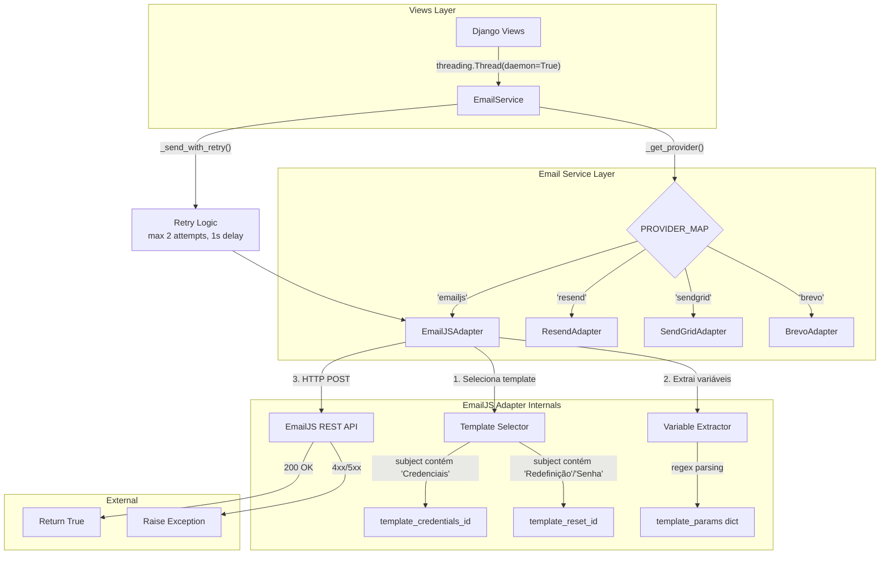

# Design Document: EmailJS Provider

## Overview

Este documento descreve o design técnico para integração do EmailJS como provedor de e-mail na plataforma HED AD. O `EmailJSAdapter` será implementado seguindo o padrão adapter existente (`EmailProviderAdapter`), consumindo a API REST do EmailJS (`POST https://api.emailjs.com/api/v1.0/email/send`) diretamente via `requests`.

A principal diferença em relação aos adaptadores existentes (Resend, SendGrid, Brevo) é que o EmailJS utiliza **templates configurados no dashboard** ao invés de receber HTML diretamente. Isso exige:
1. Seleção dinâmica de template baseada no tipo de e-mail (credenciais vs. redefinição de senha)
2. Extração de variáveis do HTML renderizado pelo Django para mapeamento em `template_params`
3. Autenticação via `user_id` (public key) ao invés de `api_key`

O EmailJS será configurado como **provedor padrão** quando `EMAIL_PROVIDER` não estiver definido.

### Decisões de Design

| Decisão | Rationale |
|---------|-----------|
| Importação local de `requests` dentro de `send()` | Segue o padrão dos adaptadores existentes; evita import pesado no nível do módulo conforme regra de performance |
| Extração de variáveis via regex no HTML | Abordagem leve sem dependência de parser HTML externo; os templates são controlados internamente |
| Seleção de template por subject | Mecanismo simples e determinístico; o subject já contém palavras-chave distintas ("Credenciais" vs "Redefinição"/"Senha") |
| Fallback para `template_credentials_id` | Garante que e-mails sempre tenham um template válido mesmo em cenários inesperados |
| Construtor diferenciado (sem `api_key`) | EmailJS usa `service_id` + `user_id` + template IDs; lógica condicional em `_get_provider()` trata essa diferença |

## Architecture



### Fluxo de Dados

1. View Django dispara envio em background thread
2. `EmailService` resolve o provedor via `PROVIDER_MAP`
3. Para `'emailjs'`, instancia `EmailJSAdapter` com credenciais específicas
4. `EmailJSAdapter.send()`:
   - Determina `template_id` baseado no subject
   - Extrai variáveis do HTML ou usa `template_params` fornecido
   - Envia POST para API REST do EmailJS
5. Retry logic no `EmailService` trata erros transientes

## Components and Interfaces

### EmailJSAdapter

```python
class EmailJSAdapter(EmailProviderAdapter):
    """Adapter for the EmailJS email provider using REST API."""

    EMAILJS_API_URL = "https://api.emailjs.com/api/v1.0/email/send"
    MAX_HTML_CONTENT_LENGTH = 50_000

    def __init__(
        self,
        service_id: str,
        user_id: str,
        template_credentials_id: str,
        template_reset_id: str,
    ):
        """
        Initialize EmailJS adapter.

        Args:
            service_id: EmailJS service identifier.
            user_id: EmailJS public key (user_id).
            template_credentials_id: Template ID for credentials emails.
            template_reset_id: Template ID for password reset emails.

        Raises:
            ValueError: If any parameter is empty or whitespace-only.
        """
        ...

    def send(
        self,
        from_addr: str,
        to: str,
        subject: str,
        html_body: str,
        template_params: dict | None = None,
    ) -> bool:
        """
        Send email via EmailJS REST API.

        Args:
            from_addr: Sender email address.
            to: Recipient email address.
            subject: Email subject line.
            html_body: HTML content (used for variable extraction or fallback).
            template_params: Optional pre-built params dict (bypasses extraction).

        Returns:
            True on success.

        Raises:
            Exception: On HTTP 4xx/5xx response.
            requests.exceptions.RequestException: On network failure.
        """
        ...

    def _select_template_id(self, subject: str) -> str:
        """
        Select template ID based on email subject keywords.

        Priority: credentials > reset > fallback (credentials).
        """
        ...

    def _extract_credentials_params(self, html_body: str) -> dict:
        """
        Extract template variables for credentials email from rendered HTML.

        Extracts: platform_name, username, password, login_url.
        """
        ...

    def _extract_reset_params(self, html_body: str) -> dict:
        """
        Extract template variables for password reset email from rendered HTML.

        Extracts: platform_name, first_name, reset_url.
        """
        ...

    def _build_template_params(
        self,
        from_addr: str,
        to: str,
        subject: str,
        html_body: str,
        template_params: dict | None,
        template_id: str,
    ) -> dict:
        """
        Build the final template_params dict for the API payload.

        Logic:
        1. If template_params provided and non-empty, use directly
        2. If template matches credentials, extract credentials vars
        3. If template matches reset, extract reset vars
        4. Otherwise, send truncated html_body as html_content
        """
        ...
```

### EmailService Modifications

```python
# Updated PROVIDER_MAP
PROVIDER_MAP = {
    "emailjs": EmailJSAdapter,
    "resend": ResendAdapter,
    "sendgrid": SendGridAdapter,
    "brevo": BrevoAdapter,
}

class EmailService:
    def _get_provider(self) -> EmailProviderAdapter:
        """
        Resolve provider adapter. EmailJS uses different constructor params.
        """
        provider_name = settings.EMAIL_PROVIDER.strip().lower()
        
        if provider_name not in PROVIDER_MAP:
            raise ImproperlyConfigured(...)

        if provider_name == "emailjs":
            return EmailJSAdapter(
                service_id=settings.EMAILJS_SERVICE_ID,
                user_id=settings.EMAILJS_USER_ID,
                template_credentials_id=settings.EMAILJS_TEMPLATE_CREDENTIALS_ID,
                template_reset_id=settings.EMAILJS_TEMPLATE_RESET_ID,
            )
        
        adapter_class = PROVIDER_MAP[provider_name]
        return adapter_class(api_key=settings.EMAIL_API_KEY)

    def _validate_configuration(self) -> None:
        """
        Extended validation: checks EmailJS-specific vars when provider is 'emailjs'.
        """
        ...
```

### Settings Additions (settings.py)

```python
# EmailJS Configuration
EMAIL_PROVIDER = os.environ.get('EMAIL_PROVIDER', 'emailjs')  # Default changed to 'emailjs'
EMAILJS_SERVICE_ID = os.environ.get('EMAILJS_SERVICE_ID', '')
EMAILJS_USER_ID = os.environ.get('EMAILJS_USER_ID', '')
EMAILJS_TEMPLATE_CREDENTIALS_ID = os.environ.get('EMAILJS_TEMPLATE_CREDENTIALS_ID', '')
EMAILJS_TEMPLATE_RESET_ID = os.environ.get('EMAILJS_TEMPLATE_RESET_ID', '')
```

### Retry Logic Enhancement

O `_send_with_retry` existente será estendido para classificar erros HTTP do EmailJS:

```python
class EmailJSHTTPError(Exception):
    """Exception raised for EmailJS API HTTP errors."""
    def __init__(self, status_code: int, detail: str):
        self.status_code = status_code
        self.detail = detail
        super().__init__(f"EmailJS API error {status_code}: {detail}")

# In _send_with_retry:
NON_RETRYABLE = (ImportError, ModuleNotFoundError, TypeError, ValueError)
NON_RETRYABLE_HTTP_CODES = {400, 401, 403}  # Bad request, auth errors
```

O `EmailJSAdapter` lançará `EmailJSHTTPError` com o `status_code` para que o `_send_with_retry` possa inspecionar e decidir se deve fazer retry:
- **Retry**: 429 (rate limit), 5xx (server errors), network/timeout exceptions
- **Não retry**: 400 (bad request), 401/403 (auth errors)

## Data Models

### Payload da API EmailJS (Request)

```json
{
    "service_id": "service_abc123",
    "template_id": "template_xyz789",
    "user_id": "user_public_key",
    "template_params": {
        "from_addr": "noreply@hedcampanhas.com.br",
        "to": "parceiro@empresa.com",
        "subject": "HED Campanhas - Suas Credenciais de Acesso",
        "platform_name": "HED Campanhas",
        "username": "parceiro01",
        "password": "Abc123!@#",
        "login_url": "https://hedcampanhas.com.br/login"
    }
}
```

### Template Params por Tipo de E-mail

**Credenciais (`template_credentials_id`):**

| Campo | Tipo | Origem | Obrigatório |
|-------|------|--------|-------------|
| `from_addr` | string | parâmetro `send()` | Sim |
| `to` | string | parâmetro `send()` | Sim |
| `subject` | string | parâmetro `send()` | Sim |
| `platform_name` | string | extraído do HTML | Sim |
| `username` | string | extraído do HTML | Sim |
| `password` | string | extraído do HTML | Sim |
| `login_url` | string | extraído do HTML | Sim |

**Redefinição de Senha (`template_reset_id`):**

| Campo | Tipo | Origem | Obrigatório |
|-------|------|--------|-------------|
| `from_addr` | string | parâmetro `send()` | Sim |
| `to` | string | parâmetro `send()` | Sim |
| `subject` | string | parâmetro `send()` | Sim |
| `platform_name` | string | extraído do HTML | Sim |
| `first_name` | string | extraído do HTML | Sim |
| `reset_url` | string | extraído do HTML | Sim |

**Fallback (HTML genérico):**

| Campo | Tipo | Origem | Obrigatório |
|-------|------|--------|-------------|
| `from_addr` | string | parâmetro `send()` | Sim |
| `to` | string | parâmetro `send()` | Sim |
| `subject` | string | parâmetro `send()` | Sim |
| `html_content` | string | `html_body` truncado (max 50.000 chars) | Sim |

### Variáveis de Ambiente

| Variável | Descrição | Obrigatória (quando provider=emailjs) |
|----------|-----------|---------------------------------------|
| `EMAIL_PROVIDER` | Provedor de e-mail (default: `emailjs`) | Não (default aplicado) |
| `EMAILJS_SERVICE_ID` | ID do serviço no painel EmailJS | Sim |
| `EMAILJS_USER_ID` | Public key da conta EmailJS | Sim |
| `EMAILJS_TEMPLATE_CREDENTIALS_ID` | ID do template de credenciais | Sim |
| `EMAILJS_TEMPLATE_RESET_ID` | ID do template de redefinição | Sim |
| `EMAIL_API_KEY` | Chave API (para outros provedores) | Não (quando emailjs) |
| `EMAIL_FROM_ADDRESS` | Endereço remetente | Sim (todos provedores) |

### Regex Patterns para Extração de Variáveis

```python
# Credentials email extraction patterns
PLATFORM_NAME_PATTERN = r'<strong>([^<]+)</strong>\s*foi criada'
USERNAME_PATTERN = r'Usuário</p>\s*<p[^>]*>([^<]+)</p>'
PASSWORD_PATTERN = r'Senha</p>\s*<p[^>]*>([^<]+)</p>'
LOGIN_URL_PATTERN = r'<a\s+href="([^"]+)"[^>]*>[^<]*</a>\s*</td>\s*</tr>\s*</table>\s*</td>\s*</tr>\s*</table>'

# Reset email extraction patterns  
RESET_PLATFORM_PATTERN = r'<h1[^>]*>([^<]+)</h1>'
FIRST_NAME_PATTERN = r'Olá,\s*<strong>([^<]+)</strong>'
RESET_URL_PATTERN = r'<a\s+href="([^"]+)"[^>]*>\s*Redefinir Senha\s*</a>'
```


## Correctness Properties

*A property is a characteristic or behavior that should hold true across all valid executions of a system—essentially, a formal statement about what the system should do. Properties serve as the bridge between human-readable specifications and machine-verifiable correctness guarantees.*

### Property 1: Constructor rejects invalid parameters

*For any* combination of `service_id`, `user_id`, `template_credentials_id`, and `template_reset_id` where at least one is an empty string or contains only whitespace characters, the `EmailJSAdapter` constructor SHALL raise `ValueError`.

**Validates: Requirements 1.1, 2.1**

### Property 2: API request is correctly formed

*For any* valid `from_addr`, `to`, `subject`, and `html_body` strings, the `EmailJSAdapter.send()` method SHALL issue an HTTP POST to `https://api.emailjs.com/api/v1.0/email/send` with `Content-Type: application/json` header, timeout of 10 seconds, and a JSON payload containing `service_id`, `template_id`, `user_id`, and `template_params` with at minimum the keys `from_addr`, `to`, and `subject`.

**Validates: Requirements 1.2, 1.3, 7.3**

### Property 3: HTTP error responses raise exceptions

*For any* HTTP response with status code >= 400, the `EmailJSAdapter.send()` method SHALL raise an exception containing the status code and response detail (first 200 characters).

**Validates: Requirements 1.4**

### Property 4: Network exceptions propagate

*For any* `requests.exceptions.RequestException` raised during the HTTP call, the `EmailJSAdapter.send()` method SHALL re-raise the original exception after logging the error.

**Validates: Requirements 1.5**

### Property 5: Template selection follows priority rules

*For any* email subject string, the `_select_template_id` method SHALL return:
- `template_credentials_id` if the subject contains "Credenciais" (case-insensitive), regardless of other keywords present
- `template_reset_id` if the subject contains "Redefinição" or "Senha" (case-insensitive) but NOT "Credenciais"
- `template_credentials_id` (fallback) if the subject matches none of the above patterns

**Validates: Requirements 2.2, 2.3, 2.4, 2.5**

### Property 6: Variable extraction round-trip

*For any* valid `platform_name`, `username`, `password`, `login_url` (credentials) or `platform_name`, `first_name`, `reset_url` (reset) values that do not contain HTML special characters, rendering those values into the corresponding email template and then extracting them via the adapter's extraction methods SHALL produce the original values.

**Validates: Requirements 3.1, 3.2**

### Property 7: Failed extraction produces empty strings with warnings

*For any* HTML body that does not match the expected template structure, the extraction methods SHALL return a dictionary containing all expected keys with empty string values, and SHALL log a warning for each missing variable.

**Validates: Requirements 3.3**

### Property 8: Explicit template_params bypasses extraction

*For any* non-empty dictionary provided as `template_params` to the `send()` method, the adapter SHALL use that dictionary directly in the API payload (merged with `from_addr`, `to`, `subject`) without performing HTML extraction.

**Validates: Requirements 3.4**

### Property 9: HTML fallback respects truncation limit

*For any* HTML body string, when no template_params is provided and the subject doesn't match known templates, the `html_content` value in `template_params` SHALL be at most 50,000 characters and SHALL equal the first 50,000 characters of the original `html_body`.

**Validates: Requirements 3.5**

### Property 10: Invalid provider names are rejected

*For any* string that, after stripping whitespace and converting to lowercase, is not one of `'emailjs'`, `'resend'`, `'sendgrid'`, or `'brevo'`, the `EmailService._get_provider()` method SHALL raise `ImproperlyConfigured` with a message listing available providers.

**Validates: Requirements 4.4, 6.3**

### Property 11: Missing EmailJS configuration is detected

*For any* subset of the required EmailJS variables (`EMAILJS_SERVICE_ID`, `EMAILJS_USER_ID`, `EMAILJS_TEMPLATE_CREDENTIALS_ID`, `EMAILJS_TEMPLATE_RESET_ID`) that is empty or undefined when `EMAIL_PROVIDER='emailjs'`, the `EmailService` SHALL raise `ImproperlyConfigured` when `DEBUG=False`, or set `_skip_sending=True` when `DEBUG=True`.

**Validates: Requirements 5.5, 5.6**

### Property 12: Thread-safe concurrent execution

*For any* set of concurrent `send()` invocations from multiple threads with different parameters, each invocation SHALL produce results independent of other concurrent invocations — no shared mutable state SHALL cause one invocation's parameters to appear in another's payload.

**Validates: Requirements 7.1, 7.2, 7.5**

### Property 13: Retry classification by error type

*For any* error raised by `EmailJSAdapter.send()`, the `EmailService._send_with_retry()` SHALL:
- Retry (up to 2 attempts, 1s delay) for network errors, timeouts, 5xx status codes, and 429 (rate limit)
- NOT retry for 400 (bad request), 401 (unauthorized), or 403 (forbidden) status codes
- Return `False` after all retry attempts are exhausted

**Validates: Requirements 8.1, 8.2, 8.3, 8.4, 8.5**

## Error Handling

### Categorização de Erros

| Erro | Tipo | Ação | Retry? |
|------|------|------|--------|
| `ValueError` (construtor) | Configuração | Falha imediata na inicialização | Não |
| `ImproperlyConfigured` | Configuração | Falha na inicialização do EmailService | Não |
| HTTP 400 | Requisição inválida | Log + exceção | Não |
| HTTP 401/403 | Autenticação | Log + exceção | Não |
| HTTP 429 | Rate limit | Log + exceção | Sim (até 2x) |
| HTTP 5xx | Servidor | Log + exceção | Sim (até 2x) |
| `ConnectTimeout` | Rede | Log + re-raise | Sim (até 2x) |
| `ReadTimeout` | Rede | Log + re-raise | Sim (até 2x) |
| `ConnectionError` | Rede | Log + re-raise | Sim (até 2x) |
| `RequestException` (genérica) | Rede | Log + re-raise | Sim (até 2x) |
| Extração de variável falha | Degradação | Warning + string vazia | N/A (não impede envio) |

### Implementação do EmailJSHTTPError

```python
class EmailJSHTTPError(Exception):
    """Exception for EmailJS API HTTP errors with status code classification."""
    
    def __init__(self, status_code: int, detail: str):
        self.status_code = status_code
        self.detail = detail
        super().__init__(f"EmailJS API error {status_code}: {detail}")
    
    @property
    def is_retryable(self) -> bool:
        """Returns True if this error is transient and worth retrying."""
        return self.status_code == 429 or self.status_code >= 500
```

### Modificação no _send_with_retry

O método `_send_with_retry` será estendido para inspecionar `EmailJSHTTPError`:

```python
def _send_with_retry(self, to, subject, html, max_retries=2):
    NON_RETRYABLE = (ImportError, ModuleNotFoundError, TypeError, ValueError)
    
    for attempt in range(1, max_retries + 1):
        try:
            self.provider.send(...)
            return True
        except NON_RETRYABLE as e:
            logger.error("Erro não-recuperável: %s", str(e))
            return False
        except EmailJSHTTPError as e:
            if not e.is_retryable:
                logger.error("Erro HTTP não-recuperável (%d): %s", e.status_code, e.detail)
                return False
            # Transient - continue retry loop
            logger.warning("Erro transiente (%d), tentativa %d/%d", e.status_code, attempt, max_retries)
            if attempt < max_retries:
                time.sleep(1)
        except Exception as e:
            logger.warning("Falha tentativa %d/%d: %s", attempt, max_retries, str(e))
            if attempt < max_retries:
                time.sleep(1)
    
    logger.error("Todas as %d tentativas falharam para %s.", max_retries, to)
    return False
```

### Logging Strategy

Todos os logs seguem o padrão existente em pt-BR:

| Nível | Quando | Exemplo |
|-------|--------|---------|
| `INFO` | Envio bem-sucedido | `"Email enviado com sucesso via EmailJS para parceiro@empresa.com"` |
| `WARNING` | Variável não extraída | `"Variável 'username' não extraída do HTML para template de credenciais"` |
| `WARNING` | Config incompleta (DEBUG) | `"Configuração EmailJS incompleta: EMAILJS_SERVICE_ID não definido"` |
| `ERROR` | HTTP 4xx/5xx | `"EmailJS API retornou status 401 para dest@email.com: Unauthorized..."` |
| `ERROR` | Exceção de rede | `"Falha ao enviar email via EmailJS para dest@email.com: Connection timeout"` |

## Testing Strategy

### Abordagem Dual: Unit Tests + Property Tests

A estratégia de testes combina:
- **Property-based tests** (Hypothesis): verificam propriedades universais com 100+ iterações
- **Unit tests** (pytest): verificam exemplos específicos, edge cases e integração entre componentes

### Property-Based Testing (Hypothesis)

**Biblioteca**: [Hypothesis](https://hypothesis.readthedocs.io/) (já presente no projeto — diretório `.hypothesis/` existe)

**Configuração**: Mínimo 100 iterações por property test.

**Tag format**: `# Feature: emailjs-provider, Property {N}: {title}`

**Properties a implementar:**

| Property | Foco | Mocks necessários |
|----------|------|-------------------|
| 1: Constructor validation | `EmailJSAdapter.__init__` | Nenhum |
| 2: API request formation | `send()` payload | `requests.post` |
| 3: HTTP error handling | `send()` error path | `requests.post` (retorna 4xx/5xx) |
| 4: Network error propagation | `send()` network errors | `requests.post` (raises) |
| 5: Template selection | `_select_template_id` | Nenhum |
| 6: Variable extraction round-trip | `_extract_*_params` | Nenhum |
| 7: Failed extraction | `_extract_*_params` | Nenhum |
| 8: Template params bypass | `_build_template_params` | Nenhum |
| 9: HTML truncation | `_build_template_params` | Nenhum |
| 10: Invalid provider rejection | `EmailService._get_provider` | Django settings |
| 11: Missing config detection | `EmailService._validate_configuration` | Django settings |
| 12: Thread safety | `send()` concurrent | `requests.post` + threads |
| 13: Retry classification | `_send_with_retry` | `EmailJSAdapter.send` |

### Unit Tests (pytest)

**Exemplos específicos a cobrir:**

- Instanciação com settings reais do `.env`
- Envio de e-mail de credenciais com template correto
- Envio de e-mail de redefinição com template correto
- Backward compatibility: `EMAIL_PROVIDER=resend` continua funcionando
- Default provider: `EMAIL_PROVIDER=''` usa emailjs
- `.env.example` contém todas as variáveis necessárias
- Timeout de 10s é respeitado (mock com side_effect de timeout)

### Estrutura de Arquivos de Teste

```
signage/
└── tests/
    ├── test_emailjs_adapter.py          # Unit tests do adapter
    ├── test_emailjs_adapter_props.py    # Property tests do adapter
    ├── test_email_service_emailjs.py    # Unit tests do service com emailjs
    └── test_email_service_props.py      # Property tests do service
```

### Generators (Hypothesis Strategies)

```python
from hypothesis import strategies as st

# Valid email addresses
valid_emails = st.from_regex(r"[a-z]{3,10}@[a-z]{3,8}\.[a-z]{2,4}", fullmatch=True)

# Non-empty strings (for constructor params)
non_empty_strings = st.text(min_size=1, max_size=50).filter(lambda s: s.strip())

# Subjects with credential keywords
credential_subjects = st.text(min_size=1, max_size=100).map(
    lambda s: s + " Credenciais"
)

# Subjects with reset keywords
reset_subjects = st.one_of(
    st.text(min_size=1, max_size=100).map(lambda s: s + " Redefinição"),
    st.text(min_size=1, max_size=100).map(lambda s: s + " Senha"),
)

# Subjects without any matching keywords
neutral_subjects = st.text(min_size=1, max_size=100).filter(
    lambda s: "credenciais" not in s.lower()
    and "redefinição" not in s.lower()
    and "senha" not in s.lower()
)

# HTML bodies of various sizes (for truncation testing)
html_bodies = st.text(min_size=0, max_size=100_000)

# HTTP error status codes
error_status_codes = st.integers(min_value=400, max_value=599)
retryable_status_codes = st.one_of(
    st.just(429),
    st.integers(min_value=500, max_value=599),
)
non_retryable_status_codes = st.sampled_from([400, 401, 403])
```
